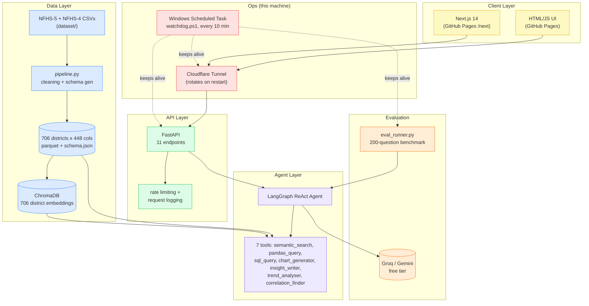

# BharatHealth Analyst

**A natural-language LLM agent over India's NFHS-5 district health data — 706 districts, 448 indicators, queryable in plain English.**

[](https://github.com/Rayyan-mohammed/aarogya-lens/actions/workflows/tests.yml)
[](tests/test_api.py)
[](requirements.txt)
[](backend/api/main.py)
[](frontend-nextjs/)
[](LICENSE)

---

## The pitch

BharatHealth Analyst is a LangGraph ReAct agent that answers questions like *"which 10 districts have the worst child anaemia?"* or *"is sanitation correlated with stunting in Bihar?"* directly against India's NFHS-5 district health survey — no SQL, no pivot tables. The agent has **7 real tools (semantic search, pandas/SQL query, chart generation, trend and correlation analysis) verified end-to-end against a live LLM**, sitting on top of a data pipeline that merges 706 districts × 448 indicators with real NFHS-4 (2015-16) trend data for 62 of them.

> **Status: working prototype, in progress since 2026-06-02 (11 weeks).** The data pipeline, vector store, agent, API, and both frontends are built, tested, and running. The one thing *not* yet proven is the full 200-question accuracy benchmark — it has been blocked twice by free-tier LLM rate limits (Groq, then Gemini) and does not yet have a clean final score. See [Results](#results) for exactly what is and isn't proven.

---

## Architecture



Both frontends and the evaluation harness converge on a single FastAPI process running on one physical machine, reachable only through a Cloudflare Tunnel that a Windows Scheduled Task restarts and re-points every 10 minutes — there is no independent cloud backend, which is both the cheapest possible deployment and the biggest single point of failure (see [Honest limitations](#honest-limitations)).

---

## The problem

India's NFHS-5 survey covers 707 districts across 36 states/UTs with 448+ health, nutrition, and sanitation indicators per district — but it ships as raw CSV factsheets and hundred-page-per-state PDF reports. Answering something as simple as "which districts have the worst child anaemia" means manually cross-referencing a column out of 448 across every district row, and a trend question ("which districts improved most since 2015-16") means separately pulling and aligning an entirely different NFHS-4 dataset by hand. There's no query interface between "I have a health-policy question" and "I have the raw survey files."

---

## How it works

| Layer / Component | What it does |
|---|---|
| **Data pipeline** (`backend/data/pipeline.py`) | Cleans the raw NFHS-5 factsheet CSV into 706 districts × 448 columns and generates `schema.json`, verified byte-for-byte in sync with the data. |
| **NFHS-4 trend merge** (`backend/data/nfhs4_integration.py`) | Merges real 2015-16 state-level NFHS-4 values for 62 indicators as a trend baseline, fallback-fills 2,286 missing NFHS-5 cells, and flags every imputed value with `_is_imputed`. |
| **Vector store** (`backend/vector_store/`) | Embeds all 706 district summaries into ChromaDB with `all-MiniLM-L6-v2` — local, no API key required. |
| **Agent** (`backend/agent/agent.py`) | A LangGraph ReAct agent that plans and calls 7 tools (semantic search, pandas/SQL query, chart generation, insight writing, trend analysis, correlation) to answer a question. |
| **Sandboxed execution** (`backend/agent/tools/tools.py`) | `pandas_query` runs LLM-generated pandas code inside a restricted `exec()` with a whitelisted globals dict and a forbidden-token filter (blocks `import`, `open(`, `__`, `os.`, `sys.`, `subprocess`) — a custom sandbox, not the `RestrictedPython` library. |
| **API** (`backend/api/main.py`) | FastAPI, 11 endpoints, with rate-limiting and request-logging middleware. |
| **Frontends** (`frontend/`, `frontend-nextjs/`) | An original single-page HTML/JS UI and a Next.js 14 App Router rewrite, both static, both deployed on GitHub Pages, both talking to the same tunneled API. |
| **Evaluation harness** (`backend/evaluation/eval_runner.py`) | Runs a 200-question benchmark with programmatically computed ground truth and 5 metrics (EA, AF, HR, RCQ, latency), checkpointing after every question. |
| **Ops** (`scripts/watchdog.ps1`) | A Windows Scheduled Task, every 10 minutes, that restarts the backend/tunnel if down and pushes the new tunnel URL straight to the `gh-pages` branch. |

---

## Results

### 1. Data pipeline is complete and internally consistent

| Check | Result |
|---|---|
| District coverage | 706 districts × 448 columns |
| NFHS-4 trend columns | 62 indicators merged, matching `schema.json` exactly (448/448 columns, zero drift) |
| Imputed cells | 2,286 missing NFHS-5 values fallback-filled, each flagged `_is_imputed` |
| DVC reproducibility | `dvc repro` — every regenerated output hashed **byte-for-byte identical** to what was already on disk; `dvc status` clean |

> **Honest scope:** the NFHS-4 trend baseline is state-level, not district-level, because that's what the source file (`NFHS-4_NFHS3_Factsheet-All_India_Indicators_R1.csv`) actually contains. Trend answers are disclosed to the user as state-baseline comparisons, not true district-to-district deltas.

### 2. Automated test suite passes, with measured (not estimated) coverage

Verified locally on 2026-08-19:

| Module | Coverage |
|---|---|
| `backend/api/main.py` (11 endpoints) | 93% |
| `backend/agent/tools/tools.py` (7 tools) | 72% |
| `backend/evaluation/eval_runner.py` | 47% |
| **Total, 63 tests** | **all passing, 67% combined** |

> **Honest scope:** the untested 53% of `eval_runner.py` is almost entirely the live LLM-calling orchestration loop — it can only be exercised by an actual model run, not a unit test with a mocked response.

### 3. Agent verified end-to-end against a real LLM — full benchmark is not

The 200-question benchmark (`benchmark_questions.json`: 59 factual, 52 ranking/aggregation, 30 state comparison, 38 trend, 21 correlation) has been attempted twice:

| Attempt | Date | Model | Outcome |
|---|---|---|---|
| Full run #1 | 2026-08-17 | Groq `llama-3.3-70b-versatile` | Completed all 200, but Groq deprecated the model mid-run — result file kept as `eval_results.groq_contaminated_aug17.json` and **not used**, since an unknown fraction of answers came from a model that no longer existed by the time the run finished. |
| Full run #2 | 2026-08-19 – ongoing | Gemini `gemini-3.6-flash` | Blocked by Gemini's free tier: **20 requests/day**. At that rate, 200 questions take 10+ days minimum. |

> **Honest scope:** no clean final EA/AF/HR/RCQ numbers exist yet. What *is* verified: the agent correctly calls tools and returns structured answers in ad-hoc manual testing (`scripts/demo.py`, `scripts/quick_demo.py`), and several real scoring bugs in the evaluation code itself were found and fixed by running it against live output (e.g. `extract_numeric` grabbing the wrong number from phrases like "aged 15-49", `correlation_finder` returning all 706 districts as scatter data in a single ~31,000-token response). See [docs/COMPLETION_SUMMARY.md](docs/COMPLETION_SUMMARY.md) for the full bug list.

### 4. Both frontends are deployed, not just built

| Frontend | URL | Last deployed |
|---|---|---|
| Original HTML/JS | [rayyan-mohammed.github.io/aarogya-lens](https://rayyan-mohammed.github.io/aarogya-lens/) | auto-redeployed by the watchdog whenever the tunnel URL rotates |
| Next.js 14 (App Router) | [rayyan-mohammed.github.io/aarogya-lens/next](https://rayyan-mohammed.github.io/aarogya-lens/next/) | 2026-08-19 |

> **Honest scope:** both are static exports pointed at a tunneled API on a personal machine, not a persistent cloud backend. Render, Hugging Face Spaces, and Vercel were each tried for the API and each hit a real platform wall (billing requirement, billing requirement, 250MB serverless function size limit) — not a config mistake. If this machine is off, both frontends' live-query feature is down, though the static pages themselves still load.

---

## Honest limitations

- **No completed accuracy benchmark.** Two full 200-question runs have been attempted; one is disqualified (model deprecated mid-run), the other is rate-limited to ~20 questions/day. There is currently no trustworthy EA/AF/HR/RCQ number for this system.
- **Single point of failure by design.** The API only exists as long as this one Windows machine is on and the Cloudflare Tunnel is up. A watchdog auto-restarts it, but there is no redundancy.
- **No production LLM key.** Of five configured providers (Groq, Gemini, OpenRouter, Grok, DeepSeek), none is a paid tier — Claude and GPT-4o code paths in `agent.py` exist but have never been run against a real key.
- **CI runs against fixture data, not the DVC pipeline.** `.github/workflows/tests.yml` rebuilds the processed dataset from two small CSV copies checked into `.github/ci-fixtures/` because the configured DVC remote is a local-only folder on the author's machine — `dvc pull` can't reach it from a GitHub Actions runner. See [.github/ci-fixtures/README.md](.github/ci-fixtures/README.md).
- **Trend data is a state-level approximation.** NFHS-4 comparisons are disclosed as state-baseline, not true district-level, because the source data is state-level.
- **The benchmark question generator isn't fully reproducible.** 119 of the 200 questions come from a seeded script; the remaining 81 come from a second script using unseeded `random.choice()`, so the full set can't be regenerated byte-for-byte — it's tracked as data, not pipeline output.

---

## Repository structure

```
aarogya-lens/
├── backend/
│   ├── agent/agent.py              # LangGraph ReAct agent + system prompt
│   ├── agent/tools/tools.py        # 7 tools, incl. the sandboxed pandas_query
│   ├── api/main.py                 # FastAPI app, 11 endpoints
│   ├── api/middleware.py           # rate limiting + request logging
│   ├── data/pipeline.py            # NFHS-5 cleaning + schema generation
│   ├── data/nfhs4_integration.py   # NFHS-4 trend merge + fallback fill
│   ├── data/*.parquet, schema.json # processed dataset (DVC-tracked)
│   ├── evaluation/eval_runner.py   # 200-question benchmark runner, 5 metrics
│   ├── evaluation/benchmark_questions.json
│   └── vector_store/               # ChromaDB build + index
├── frontend/index.html             # original single-page UI (deployed)
├── frontend-nextjs/                # Next.js 14 rewrite (deployed as static export)
├── tests/                          # 63 pytest tests
├── scripts/                        # watchdog, manual demo/smoke scripts (not pytest)
├── docs/                           # blueprint, technical report, deployment guide
├── dataset/                        # raw source CSVs/PDFs (DVC-tracked)
├── dvc.yaml, .dvc/                 # data versioning, verified with dvc repro
├── Dockerfile, docker-compose.yml  # verified locally
└── render.yaml                     # kept for reference; Render hit a billing wall
```

---

## Quick start

Zero external dependencies, zero API keys, just the pre-built data:

```bash
pip install -r requirements.txt

# run the full test suite — no LLM key needed, nothing leaves your machine
pytest
```

That exercises the data pipeline, all 7 agent tools, and every API endpoint against fixtures — the fastest way to see the core system actually work.

---

## Reproduce everything else

```bash
# local dev — full stack with a live agent (needs GROQ_API_KEY or GEMINI_API_KEY in .env)
python -m uvicorn backend.api.main:app --reload --port 8000
python -m http.server 3000 --directory frontend          # original UI, new terminal
cd frontend-nextjs && npm install && npm run dev          # or the Next.js UI, new terminal
```

```bash
# data pipeline, from raw CSVs
dvc repro                          # rebuilds parquet, schema.json, vector store, benchmark set
dvc status                         # should report clean
```

```bash
# evaluation — small sample, not the full 200-question run
python -m backend.evaluation.eval_runner --model groq --n 5
```

```bash
# docker — verified to build and run locally, matches production Dockerfile
docker compose up --build
curl http://localhost:8000/health
```

---

## Operational notes

There's no cloud billing risk here — everything runs on free-tier API quotas and a local machine, so there's no runaway-cost scenario to guard against. The actual operational risk is the opposite: a background process silently burning through a free-tier daily quota. To stop everything cleanly:

```powershell
# stop the watchdog scheduled task (backend, tunnel, and benchmark stop restarting)
schtasks /end /tn BharatHealthWatchdog
schtasks /delete /tn BharatHealthWatchdog /f

# stop the running backend and tunnel processes
Get-Process uvicorn, cloudflared -ErrorAction SilentlyContinue | Stop-Process
```

The watchdog exists precisely because early runs of the benchmark got silently killed by machine sleep and had to be restarted from question 1 more than once — it trades "runs unattended" for "you must remember it's running."

---

## Roadmap

| Phase | Data pipeline | Agent + tools | API | Frontends | Evaluation | Deployment |
|---|---|---|---|---|---|---|
| Weeks 1-4 (Jun 2026) | ✅ NFHS-5 clean + schema | ✅ 7 tools built | — | — | — | — |
| Weeks 5-8 (Jul 2026) | ✅ NFHS-4 trend merge | ✅ ReAct agent wired up | ✅ 11 endpoints + middleware | ✅ HTML/JS UI | ✅ 200-Q set + 5 metrics | ✅ Docker local |
| Weeks 9-11 (Aug 2026) | ✅ DVC pipeline verified | ✅ sandboxed pandas_query | ✅ 93% test coverage, ✅ CI on every push | ✅ Next.js rewrite deployed | ⏳ blocked on free-tier quota (2 attempts) | ✅ GitHub Pages (both), tunnel + watchdog |
| Next | Real DVC remote (CI still uses fixture CSVs) | Claude/GPT-4o path, untested | — | — | Complete a clean 200-Q run | Persistent (non-tunnel) API host |

---

## Authors

- **Mohammed Rayyan** ([rayyan1652@gmail.com](mailto:rayyan1652@gmail.com)) — sole author and owner of the entire system: data pipeline, agent and tools, API, both frontends, evaluation harness, and deployment/ops. B.Tech CSE (Data Science), NMIMS University, Hyderabad.

---

## Documentation index

- [docs/COMPLETION_SUMMARY.md](docs/COMPLETION_SUMMARY.md) — continuously-updated, ground-truth status of every component
- [docs/BharatHealth_Project_Blueprint.md](docs/BharatHealth_Project_Blueprint.md) — original project scope and design intent
- [docs/TECHNICAL_REPORT.md](docs/TECHNICAL_REPORT.md) — architecture and implementation write-up
- [docs/DEPLOYMENT_GUIDE.md](docs/DEPLOYMENT_GUIDE.md) — what was tried (Render, HF Spaces, Vercel) and why each didn't stick
- [docs/SUBMISSION_PACKAGE.md](docs/SUBMISSION_PACKAGE.md) — coursework/submission-facing summary
- [scripts/README.md](scripts/README.md) — what each manual demo/smoke-test script does
- [.github/ci-fixtures/README.md](.github/ci-fixtures/README.md) — why CI rebuilds data from fixture CSVs instead of `dvc pull`
- [LICENSE](LICENSE) — MIT
